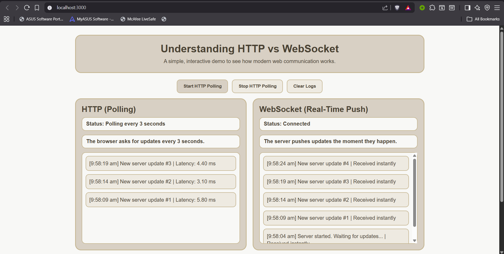
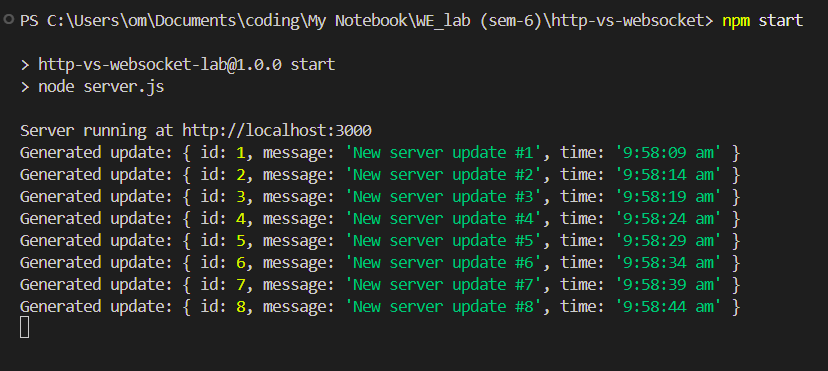

# HTTP vs WebSocket Communication Lab

A simple demonstration website for comparing:

- HTTP polling
- WebSocket real-time communication

## Screenshots



## Features

- HTTP client requests updates every 3 seconds
- WebSocket client receives server updates instantly
- Side-by-side comparison in one page

## Required

- Node.js installed

## Run steps

```bash
npm install
npm start
```

Then open:

```bash
http://localhost:3000
```

## Lab idea

The server generates a new notification every 5 seconds.

- In HTTP mode, client keeps asking for updates.
- In WebSocket mode, server pushes updates automatically.
